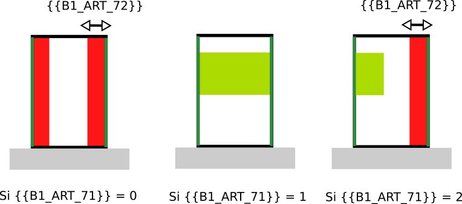

# IAUIDF-002 - Distance et alignement par rapport aux limites séparatives

## Modèle de phrase

> Une distance par rapport aux limites séparatives latérales de la parcelle de {{B1_ART_72}} m doit être respectée.
> Un alignement est imposé par rapport aux côtés des limites séparatives  {{B1_ART_71}}

## Paramètres
*  {{B1_ART_71}}: Distance de recul en m par rapport aux limites séparatives latérales.
*  {{B1_ART_72}}: Implantation en limite séparatives
  * 0 : non, retrait imposé (cf.72)
  * 1 : Oui des deux côtés
  * 2 : Oui, mais sur un côté seulement

## Explications

Suivant les cas imposés par {{B1_ART_72}} :
* si {{B1_ART_72}} = 0, on ne peut construire à moins de {{B1_ART_72} m des limites latérales ;
* si {{B1_ART_72}} = 1, le bâtiment doit être construit des deux côtés de la parcelle ;
* si {{B1_ART_72}} = 2, le bâtiment doit être collé d'un côté de la parcelle et respecter un recul par rapport à l'autre côté.

## Implémentation

La vérification de la distance s'effectue dans la classe PredicateIAUIDF. Dans le cas où le bâtiment doit être collé des deux côté ({{B1_ART_72}} = 1), pour l'instant il ne subit aucune contrainte et est libre en termes de placement. Si le bâtiment doit être d'un côté ({{B1_ART_72}} = 2), deux simulations sont effectuées en tentant de coller le bâtiment à chacun des côté de la parcelle et la simulation optimisant le volume est conservée. Le fait d'être collé est assuré lors de la génération du bâtiment (MultipleBuildingsCuboid).
