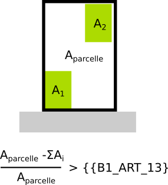

# IAUIDF-008 - Part d'espace libre dans la parcelle

## Modèle de phrase

> La part d'espace libre dans la parcelle représente au minimum {{B1_ART_13}} fois l'aire de la parcelle.

## Paramètres
*  {{B1_ART_13}} : Valeur maximale de hauteur en m (88= non renseignable, 99=non réglementé)

## Explications

{{B1_ART_13}} désigne le ratio minimum d'espace libre au sein de la parcelle

## Implémentation

La vérification du ratio s'effectue dans la classe PredicateIAUIDF. Seule la valeur de la première bande est prise en compte.
