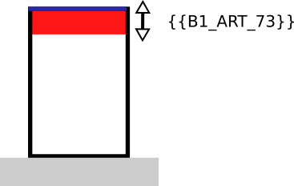

# IAUIDF-003 - Distance par rapport au fond de parcelle

## Modèle de phrase

> Une distance de {{B1_ART_73}} m doit être respecté par rapport au fond de la parcelle.

## Paramètres

### B1_ART_73

Distance minimale des constructions par rapport à la limite séparative de fond de parcelle.

Valeurs particulières :

* 99 : non réglementé

## Explications

Un recul de  {{B1_ART_73}} m s'applique par rapport au fond de la parcelle.

## Implémentation

La vérification de la distance s'effectue dans la classe PredicateIAUIDF sauf si les valeurs sont 88 et 99.

