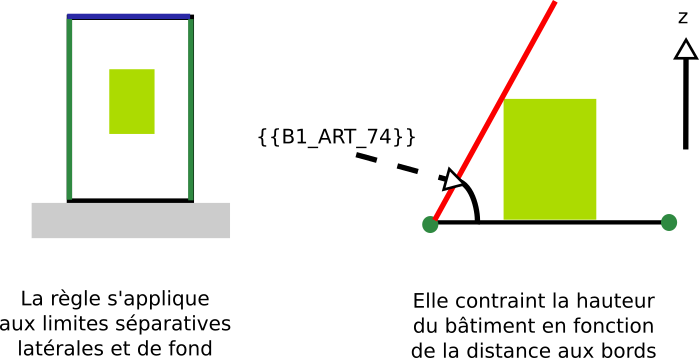

# IAUIDF-004 - Contrainte de prospect par rapport aux limites séparatives

## Modèle de phrase

> La hauteur doit être inférieure à {{B1_ART_74}} fois la distance aux limites séparatives latérales et de fond de la parcelle.

## Paramètres

### B1_ART_74

Distance minimale des constructions par rapport aux limites séparatives relative à la hauteur du bâtiment.

* 1 : Retrait de la valeur de la hauteur, H
* 2 : Retrait de la moitié de la valeur de hauteur, H / 2

## Explications

{{B1_ART_74}} représente la pente du plan sous lequel le bâtiment doit se trouver.

## Implémentation

La vérification de la distance s'effectue dans la classe PredicateIAUIDF. Si le bâtiment doit être collé sur un des bords de la parcelle (cf [RENNES-003.md](RENNES-003.md)), alors la limite à laquel le bâtiment est collé n'est pas prise en compte.
