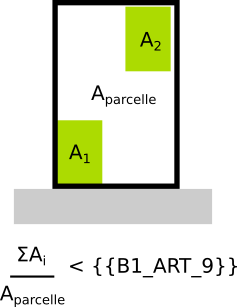

# IAUIDF-006 - Coefficient d'emprise au sol maximum

## Modèle de phrase

> Le coefficient d'emprise au sol (rapport entre surface bâtie et surface de la parcelle) est limité à {{B1_ART_9}}.

## Paramètres

### B1_ART_9

Coefficient d’emprise au sol maximum.

Ratio compris en 0 et 1.

Remarque :  Si valeur exprimée en %, convertir en ratio. Ex : 5%= 5/100 = 0,05 ; 85%= 85/100 = 0.85

## Explications

{{B1_ART_9}} indique le ratio maximal entre la surface bâtie et la surface de la parcelle.

## Implémentation

La vérificationdu ratio s'effectue dans la classe PredicateIAUIDF et seul le coefficient de la première bande est pris en compte.
