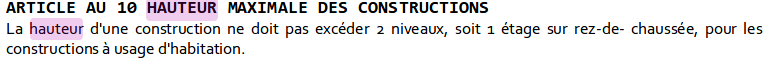

# Cas d'utilisation

## Génération des textes de document d'urbanisme

Une application qui génère les textes des documents d'urbanisme peut procéder comme suit :

* Elle fait choisir une règle à ajouter à une zone
* Elle récupère la définition de la règle au format JSON (`https://plu-rule.example.org/registry/CORE-0001.json`)
* Elle génère un formulaire pour la saisie des paramètres à l'aide du schéma JSON (voir [json-editor](https://github.com/json-editor/json-editor#json-editor))
* Elle injecte les paramètres dans le modèle de phrase

Et le tour est joué : On ajoute au document "La hauteur de construction ne doit pas dépasser **9** mètres"

## Visualisation de règles d'urbanisme

Dès lors que les règles sont identifiées, il est possible pour chaque règle de mettre en place un code informatique permettant de les comprendre.

Par exemple, pour https://plu-rule.example.org/registry/CORE-0001, on peut extruder la parcelle en fonction de `HAUTEUR` et colorier le volume en bleu pour matérialiser le volume dans lequel doit se trouver le bâtiment.

Pour une règle de recul par rapport au fond de la parcelle, on peut mettre en évidence une zone en rouge en fonction de `DISTANCE_RECUL` et

En cumulant l'ensemble des informations, on peut générer un volume dans lequel doit s'inscrire le bâtiment ce qui donne déjà une idée sur la morphologie d'un quartier engendrée par un PLU.

**Il n'y pas de magie! Pour chaque règle, il faut un code informatique et les référentiels géographiques adéquats.**.

A titre d'exemple, il n'y a pas de notion de "fond de parcelle" dans les bases cadastrales, encore moins des bandes sur ces parcelles en fonction de ces "fonds de parcelle", etc. Ensuite, si les règles ont des variantes dans la formulation de la hauteur, la machine ne devinera pas la méthode de transposition :

## Vérification de règles d'urbanisme (ex : permis de construire)

Connaissant un projet de bâtiment défini par un modèle 3D, pour vérifier https://plu-rule.example.org/registry/CORE-0001, on peut vérifier que le bâtiment ne dépasse une hauteur de `HAUTEUR` mètre.

En procédant de même pour toutes les règles, on peut savoir lesquelles sont respectées ou non.

Là encore, il n'y a pas de magie : Pour chaque règle, il faut du code et un contexte.

## Génération de bâtiment

Avec [SimPLU](https://github.com/SimPLU3D/) par exemple, on choisit un modèle de bâtiment paramétrique :

* Un cuboid défini par un centre, une longueur, une largueur, une hauteur, une orientation
* Un bâtiment simple avec un toit défini par centre, longueur, largeur, h1, h2
* ... ou tout modèle à partir des paramètres, on peut générer programmatiquement le volume

[SimPLU](https://github.com/SimPLU3D/) explore l'espace des paramètres en générant un ou des bâtiments, il contrôle pour chaque bâtiment généré les règles et conserve le meilleur suivant un critère (ex : le volume).

Remarque :

* Il suffit donc en théorie de pouvoir valider les règles pour un modèle 3D de bâtiment pour pouvoir simuler l'effet de ces règles sur la constructibilité.
* En pratique, il faut aussi être un peu intelligent sur l'ordre de validation des règles (innutile de faire les contrôles coûteux en terme de calcul ne passent pas)
* En pratique, il faut même être un peu intelligent sur l'exploration des paramètres (innutile de générer des bâtiment non alignés s'il faut les aligner)

## Exemple de registre

Le dossier [registry](registry/index.md) donne une idée de ce à quoi pourrait ressembler les données d'un registre de règles d'urbanisme.

Remarque : Il conviendra de le compléter avec les règles [SimPLU](https://github.com/SimPLU3D/) définie pour IAU IDF.

Le fichier [sample/rennes.csv](sample/rennes.csv) illustre le principe d'instanciation des règles "RENNES-" à l'aide d'un fichier CSV où :

* La première colonne `Nom_zone` permet d'identifier la zone concernée du PLU
* Les colonnes suivantes correspondent aux paramètres d'instanciation des règles
